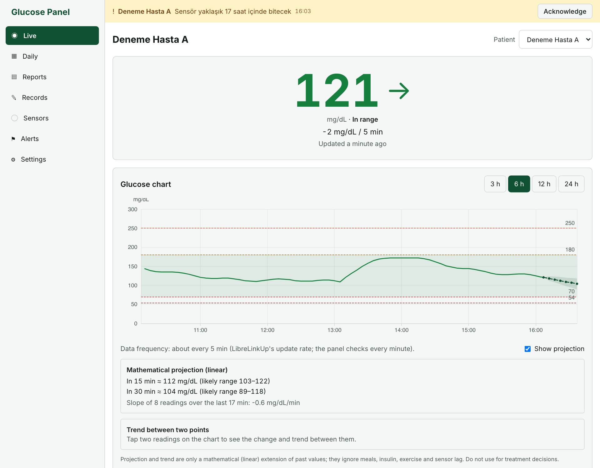
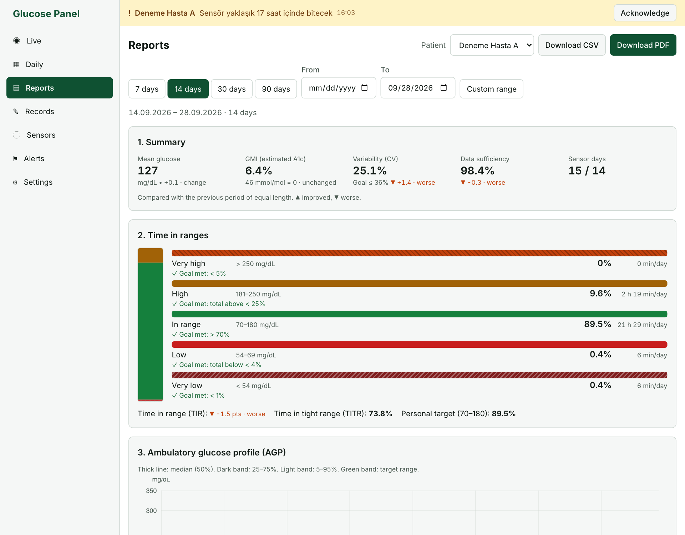
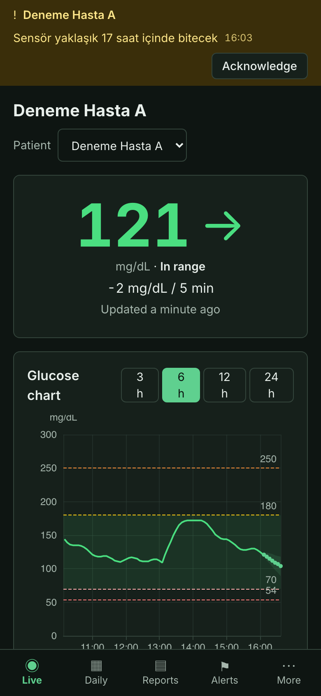

# Glukoz Paneli

**FreeStyle Libre verilerini LibreLinkUp üzerinden izleyen, kendi sunucunuzda çalışan glukoz paneli.** Canlı
değer, günlük görünüm, uluslararası CGM konsensüsüne uygun raporlar (AGP, hedef aralıkta kalma süreleri, GMI,
CV, GRI) ve uyarılar; telefona kurulabilen bir web uygulaması (PWA) olarak.

🇬🇧 **[English README](README.md)** · Ana dokümantasyon İngilizcedir.

[](LICENSE)


> [!WARNING]
> **Tıbbi cihaz değildir; tedavi kararları için kullanmayın.** Değerler gecikebilir veya eksik olabilir, uyarılar
> hiç gelmeyebilir; resmî CGM uygulamanızı ve alarmlarını kullanmaya devam edin.
> Bu proje **resmî olmayan, belgelenmemiş LibreLinkUp API'sini** kullanır; her an bozulabilir ve hizmetin
> kullanım koşullarıyla çelişebilir. **Abbott ile bağlantısı yoktur.** Lütfen **[sorumluluk reddini](DISCLAIMER.md#sorumluluk-reddi-türkçe)**
> okuyun.

| Canlı görünüm                                                                  | Raporlar                                                                                     | Mobil (koyu tema)                                                        |
| ------------------------------------------------------------------------------ | -------------------------------------------------------------------------------------------- | ------------------------------------------------------------------------ |
|  |  |  |

_Ekran görüntüleri yerleşik mock modun sentetik verileriyle alınmıştır (arayüz İngilizce gösterilmiştir; varsayılan dil Türkçedir)._

## Özellikler

- **Canlı görünüm** — anlık değer, trend oku, 5 dakikalık değişim, veri yaşı ve "veri gecikiyor" uyarısı;
  hedef bandı, eşik çizgileri ve olay işaretleriyle 3/6/12/24 saatlik grafik; anlık güncelleme (SSE).
- **Eğilim araçları** — grafikte iki ölçüme dokunarak aradaki değişim ve hız; isteğe bağlı, belirsizlik bandıyla
  kısa doğrusal öngörü (açıkça "matematiksel uzatma" olarak etiketlenir).
- **Hızlı giriş** — insülin, yemek, su, uyku ve diğerleri; "şimdi" ya da seçilen bir zaman için; grafiklerde
  işaret olarak görünür.
- **Günlük görünüm** — 24 saatlik eğri, olaylar, notlar, başka bir günle karşılaştırma.
- **Raporlar** (7/14/30/90 gün veya özel aralık): önceki dönemle karşılaştırmalı özet, hedef aralıkta kalma,
  **AGP**, günlük küçük grafikler, hipo/hiper olayları, günün dilimleri ve haftanın günleri, saat × gün ısı
  haritası, öğün sonrası analiz, GRI ızgarası, LBGI/HBGI. **PDF** (yazdırma) ve **CSV** dışa aktarma.
- **Uyarılar** — çok düşük, düşük, yüksek, hızlı düşüş/yükseliş, veri kesintisi, sensör bitişi; bekleme süreleri
  ve sessiz saatler; Web Push bildirimleri.
- **Çoklu kullanıcı ve hasta** — roller (yönetici, bakıcı, izleyici), hasta bazlı erişim, denetim kaydı.
- **Gizlilik araçları** — şifreli LibreLinkUp kimlik bilgileri (AES-256-GCM), açık rıza kaydı, saklama süresi
  işi, tam dışa aktarma ve iki aşamalı silme (KVKK ve GDPR gözetilerek).
- **PWA** — telefona kurulabilir, son verilerle çevrimdışı çalışır, açık/koyu tema, mg/dL ↔ mmol/L, Türkçe
  (varsayılan) ve İngilizce arayüz.
- **Mock mod** — geliştirme ve tanıtım için gerçekçi sentetik veri; gerçek hesap gerekmez.
- **LibreView CSV içe aktarma** — LibreLinkUp'ın döndürdüğünden eski geçmiş için.

## Nasıl çalışır

```
FreeStyle Libre sensörü ─BLE─▶ LibreLink (hastanın telefonu) ─▶ LibreView bulutu
                                                                     │  LibreLinkUp (resmî olmayan API)
                                                                     ▼
┌──────────────────────────── sizin sunucunuz ────────────────────────┐
│  Toplayıcı (60 sn) ─▶ PostgreSQL ◀─ REST API ── SSE / Web Push      │
│  Uyarı motoru                                  │                    │
└────────────────────────────────────────────────┼────────────────────┘
                                                 ▼
                                  Herhangi bir tarayıcıda PWA (React)
```

Hastanın LibreLink uygulamasından davet edilmiş **ayrı bir LibreLinkUp takipçi hesabı** gerekir; hastanın kendi
LibreLink hesabıyla giriş yapılırsa bağlantı listesi boş döner. Bkz. [docs/librelinkup.md](docs/librelinkup.md).

### Takipçi hesabı nasıl açılır

1. Takipçi için ayrı bir e-posta ile **LibreLinkUp** mobil uygulamasında hesap açın.
2. Hastanın telefonundaki **FreeStyle LibreLink** uygulamasında _Menü → Bağlantılı Uygulamalar → LibreLinkUp →
   Bağlantı ekle_ ile takipçi e-postasını davet edin.
3. Takipçi, LibreLinkUp uygulamasında daveti **kabul etsin** ve kullanım koşullarını **onaylasın**.
4. Panelde _Ayarlar → LibreLinkUp hesapları → Hesap ekle_ ile bu takipçi hesabını ekleyin.

## Hızlı kurulum (Docker Compose)

Gereksinimler: Linux sunucu (1 vCPU / 1 GB RAM yeterli), Docker ve Compose, sunucuya yönlendirilmiş bir alan
adı, açık 80/443 portları.

```bash
git clone https://github.com/mbahadirs/glukoz.git && cd glukoz
cp .env.example .env
# .env'yi doldurun — en azından:
#   openssl rand -base64 32   → ENCRYPTION_KEY   (güvenle saklayın!)
#   openssl rand -base64 48   → SESSION_SECRET
#   openssl rand -base64 24   → POSTGRES_PASSWORD
#   openssl rand -base64 32   → BACKUP_PASSPHRASE
#   npx web-push generate-vapid-keys → VAPID_PUBLIC_KEY / VAPID_PRIVATE_KEY
#   DOMAIN, APP_URL, VAPID_SUBJECT
docker compose -f docker/docker-compose.yml --env-file .env up -d --build
```

`https://<alan-adınız>/` adresini açın: ilk kurulum sayfası yönetici hesabını oluşturur. Ardından **Ayarlar →
LibreLinkUp hesapları → Hesap ekle**. Caddy TLS sertifikasını kendisi alır.

Diğer seçenekler (Coolify, doğrudan Node.js, yedekleme, sunucular arası veri taşıma):
[docs/deployment.md](docs/deployment.md) (İngilizce).

## Yerel geliştirme (mock mod)

Gereksinimler: Node.js 22, pnpm 9, PostgreSQL 16.

```bash
pnpm install
createdb glukoz && createdb glukoz_test
cp .env.example .env    # NODE_ENV=development, LLU_MOCK=true, PORT=3300, DATABASE_URL, ENCRYPTION_KEY, SESSION_SECRET
pnpm db:migrate
pnpm seed:mock          # iki sentetik hasta, 90 günlük veri
pnpm dev                # API :3300, web :5173 (/api vekili)
```

| Komut                                         | Ne yapar                                                                                |
| --------------------------------------------- | --------------------------------------------------------------------------------------- |
| `pnpm test`                                   | Birim ve entegrasyon testleri (API testleri adı `_test` ile biten bir veritabanı ister) |
| `pnpm test:e2e`                               | Mock modda çalışan derlenmiş sunucuya karşı Playwright uçtan uca testleri               |
| `pnpm lint` · `pnpm typecheck` · `pnpm build` | CI'da kullanılan kalite kontrolleri                                                     |

## Dokümantasyon

Ayrıntılı dokümantasyon İngilizcedir: [README](README.md#documentation) içindeki tabloya bakın.
Türkçe olanlar: [sorumluluk reddi](DISCLAIMER.md#sorumluluk-reddi-türkçe),
[KVKK aydınlatma şablonu](docs/kvkk-aydinlatma.md), [özgün ürün şartnamesi](docs/spec/SPEC.tr.md).

## Durum ve bilinen sınırlar

- En iyi çaba esasıyla sürdürülen bir topluluk projesidir. Üretici API'yi değiştirdiğinde LibreLinkUp
  entegrasyonu bozulabilir.
- Arayüz **Türkçe (varsayılan) ve İngilizce**dir. Sunucunun ürettiği bazı metinler (ör. uyarı mesajları) şimdilik
  yalnızca Türkçedir; kod yorumları çoğunlukla Türkçedir.
- Web Push HTTPS gerektirir; iOS'ta yalnızca uygulama ana ekrana eklendiğinde çalışır (iOS 16.4+).
- Şimdilik veri kaynağı olarak yalnızca LibreLinkUp desteklenir; kodda başka kaynaklar (ör. Nightscout) için
  `GlucoseSource` soyutlaması vardır — katkılara açıktır.
- Yerel mobil/akıllı saat uygulamaları bu deponun parçası değildir.

## Katkı

Katkılarınızı bekliyoruz. Lütfen [CONTRIBUTING.md](CONTRIBUTING.md) ve [davranış kurallarını](CODE_OF_CONDUCT.md)
okuyun. Issue, pull request, ekran görüntüsü veya test verisine **asla gerçek sağlık verisi, şifre veya token
koymayın**.

Bir güvenlik açığı mı buldunuz? Lütfen herkese açık issue yerine gizli bildirin: [SECURITY.md](SECURITY.md).

## Teşekkür

Bu proje, diyabet açık kaynak topluluğu (#WeAreNotWaiting) olmadan var olamazdı. Özellikle LibreLinkUp API'sini
belgeleyen kişilere ve raporların dayandığı klinik konsensüsün yazarlarına teşekkür ederiz. Ayrıntılar:
**[ACKNOWLEDGMENTS.md](ACKNOWLEDGMENTS.md)** ve [THIRD_PARTY_NOTICES.md](THIRD_PARTY_NOTICES.md).

## Lisans

Telif hakkı © 2026 [@mbahadirs](https://github.com/mbahadirs) ve katkıda bulunanlar.

Glukoz Paneli özgür yazılımdır; **GNU Affero Genel Kamu Lisansı v3.0 veya sonraki sürümleri** koşullarıyla
dağıtabilir ve değiştirebilirsiniz — bkz. [LICENSE](LICENSE) (bağlayıcı olan İngilizce metindir).
Değiştirilmiş bir sürümü ağ üzerinden hizmet olarak sunarsanız, AGPL kaynak kodunu kullanıcılarınıza sunmanızı
şart koşar; web arayüzündeki "Kaynak kodu" bağlantısı bunun içindir (`VITE_SOURCE_URL`).

FreeStyle Libre, LibreLink, LibreLinkUp ve LibreView, Abbott'un ticari markalarıdır. Bu proje Abbott ile
bağlantılı değildir.
